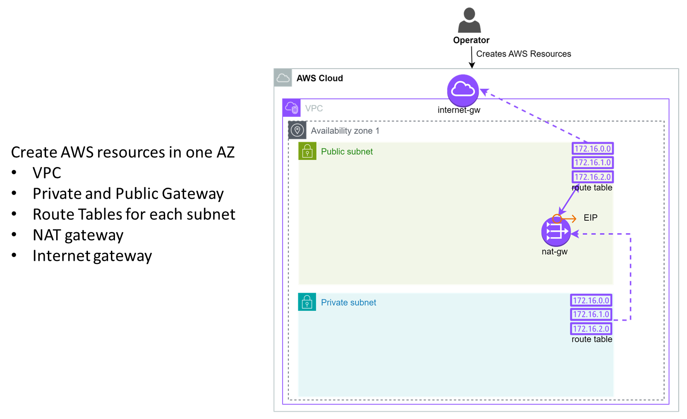
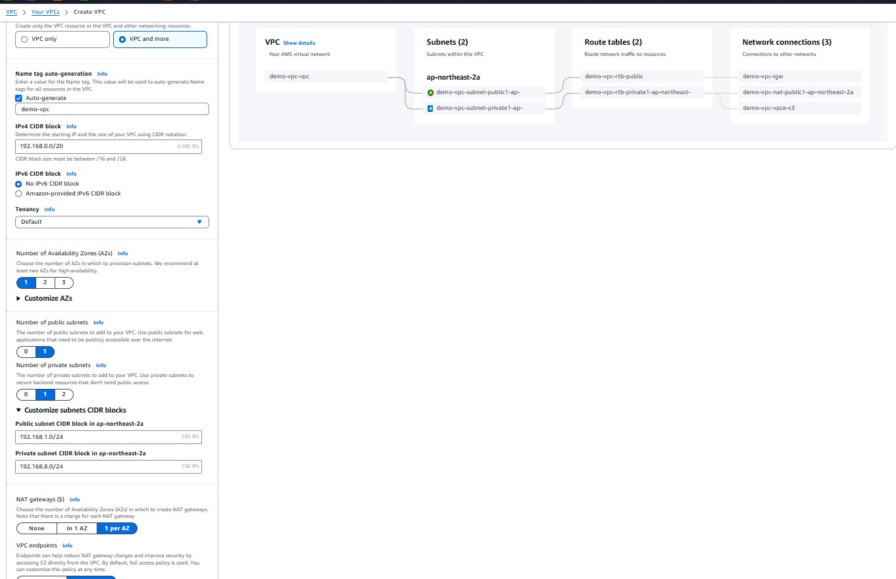
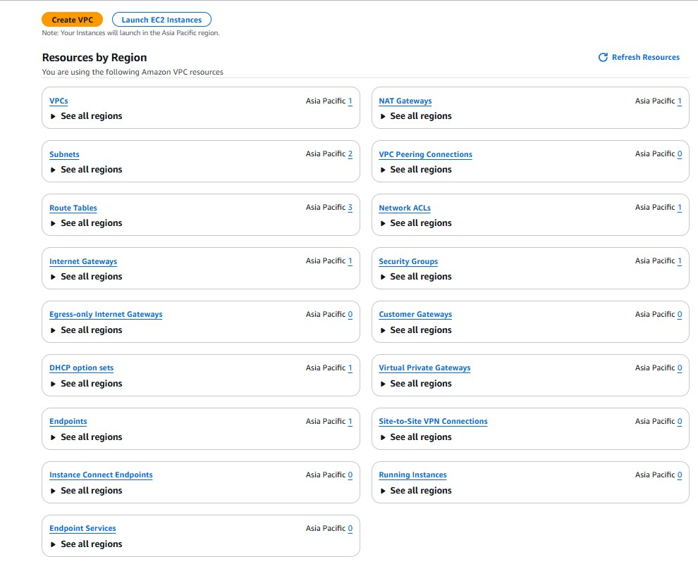
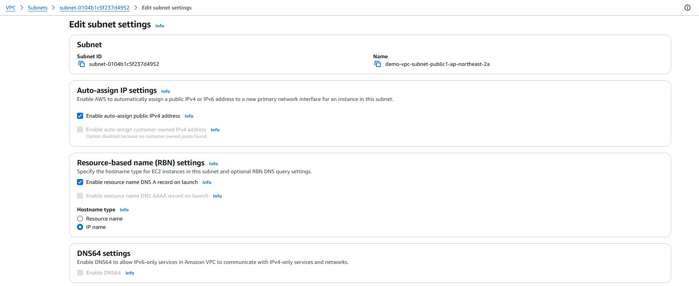
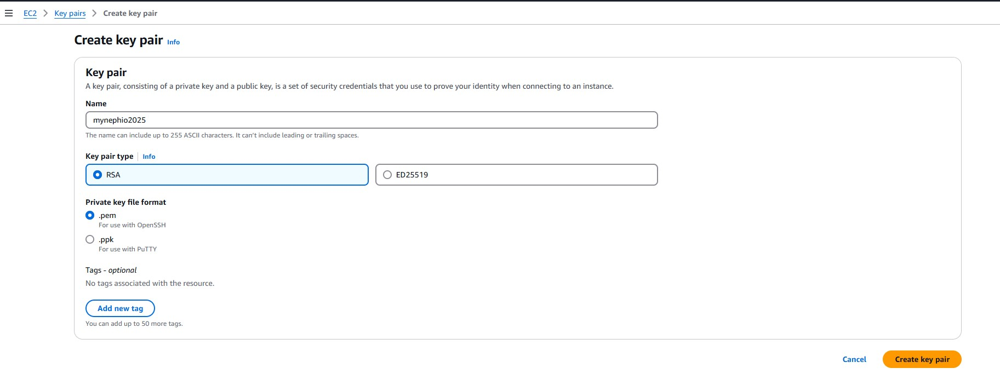
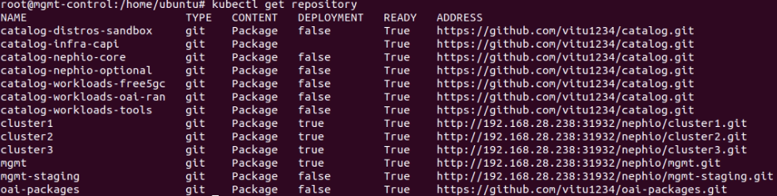
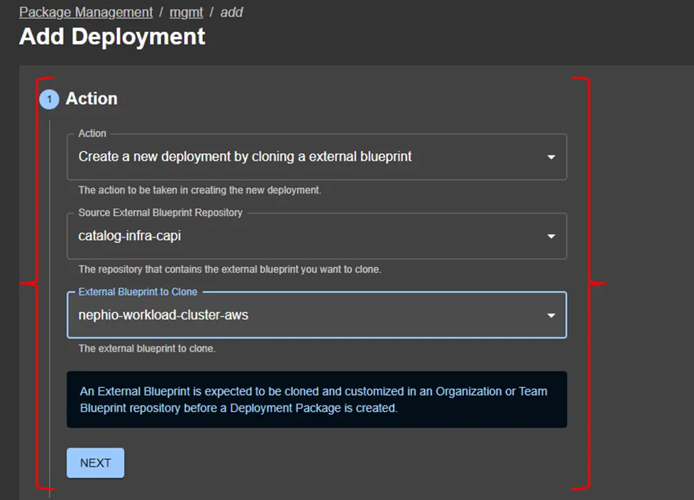

# AWS Infrastructure Setup: Nephio Management & Workload Clusters

Step-by-step guide to bootstrapping a Nephio management cluster and provisioning workload clusters on AWS using Cluster API (CAPA) and Ansible automation.

Reference [nephio-test-infra-aws](https://github.com/vitu-mafeni/nephio-test-infra-aws.git)

---

## Table of Contents

- [1. Architecture Overview](#1-architecture-overview)
- [2. Prerequisites](#2-prerequisites)
- [3. Pre-Setup: Ansible & AWS Credentials](#3-pre-setup-ansible--aws-credentials)
- [4. Configure AWS Resources (Optional)](#4-configure-aws-resources-optional)
- [5. Configure Ansible Playbooks](#5-configure-ansible-playbooks)
- [6. Bootstrap Management Cluster](#6-bootstrap-management-cluster)
- [7. Verify Management Cluster](#7-verify-management-cluster)
- [8. Access Management Cluster Dashboards](#8-access-management-cluster-dashboards)
- [9. Create Workload Clusters (Core / Regional / Edge)](#9-create-workload-clusters-core--regional--edge)
- [10. Get Kubeconfig for Workload Clusters](#10-get-kubeconfig-for-workload-clusters)
- [11. Troubleshooting](#11-troubleshooting)

---

## 1. Architecture Overview

The deployment follows four sequential installation phases:

**Phase 1 — AWS Resource Provisioning**
VPC, public/private subnets, NAT gateway, internet gateway, and route tables are created. The management cluster lives in the public subnet; all workload clusters live in private subnets.



**Phase 2 — Management Cluster Bootstrap**
Ansible automates the creation of 3 EC2 instances (1 control-plane + 2 workers), installs Kubernetes, and configures all Nephio components (Porch, ArgoCD, Gitea, Nephio controllers).


**Phase 3 — Workload Cluster Provisioning**
Workload clusters (core, regional, edge) are created via the Nephio WebUI or `porchctl`. Each cluster connects to its own Git repository on the management cluster's Gitea server. ArgoCD on each cluster watches and pulls resources.


---

## 2. Prerequisites

**Management cluster node requirements:**

| Parameter | Value |
|---|---|
| OS | Ubuntu 22.04 LTS (Jammy) |
| AMI (ap-northeast-2) | `ami-0e4ab31f1847c850c` |
| CPU | ≥ 4 cores |
| RAM | ≥ 8 GB |
| Disk | ≥ 100 GB |

**Tools required on the local workstation:**

- AWS CLI — [installation guide](https://docs.aws.amazon.com/cli/latest/userguide/getting-started-quickstart.html)
- `clusterawsadm` — [installation guide](https://cluster-api-aws.sigs.k8s.io/getting-started)
- Python 3 + pip
- Ansible

**Clone the repository:**

```bash
git clone https://github.com/vitu1234/nephio-test-infra-aws.git
cd nephio-test-infra-aws
```

**Important notes:**
- Tested on 1 region, 1 VPC, same Availability Zone with multiple subnets.
- The management cluster is deployed in a **public** subnet so that the Gitea server is reachable by all workload clusters.
- All workload clusters are deployed in **private** subnets.

---

## 3. Pre-Setup: Ansible & AWS Credentials

### 3.1 Install Python dependencies

From `e2e/provision/`:

```bash
pip install -r requirements.txt
```

Add Ansible to your PATH if it was installed to a non-standard location:

```bash
export PATH="$PATH:/home/ubuntu/.local/bin"
source ~/.bashrc
```

Install required Ansible Galaxy collections and roles:

```bash
ansible-galaxy collection install ansible.posix
ansible-galaxy collection install amazon.aws
ansible-galaxy install -r galaxy-requirements.yml
```

### 3.2 Get AWS Session Token

> **Important:** You must obtain a fresh token **before every run** of `install_sandbox.sh` (IF session tokens expired). 

Session tokens expire and all three values (`AccessKeyId`, `SecretAccessKey`, `SessionToken`) must be updated in the config files each time.

Without MFA:

```bash
aws sts get-session-token --duration-seconds 129600
```

With MFA enabled:

```bash
aws sts get-session-token --duration-seconds 129600 \
  --serial-number arn:aws:iam::<account-id>:mfa/<mfa-device-name> \
  --token-code <6-digit-code>
```

Output:

```json
{
    "Credentials": {
        "AccessKeyId":     "ASIA...",
        "SecretAccessKey": "xxxx...",
        "SessionToken":    "IQoJ...",
        "Expiration":      "2026-07-01T17:00:00+00:00"
    }
}
```

Copy all three values — they are needed in the next step and in Step 5.

### 3.3 Set up Ansible Vault for AWS credentials

Create the vault file and enter the **STS temporary credentials** from the previous step:

```bash
ansible-vault create playbooks/cred.yml
```

An editor opens. Enter:

```yaml
access_key: "ASIA..."    # AccessKeyId from STS output
secret_key: "xxxx..."    # SecretAccessKey from STS output
session_token: "....".   # SessionToken from STS output
```

Save and exit. The file is encrypted automatically.

> **Each time the token expires**, delete and recreate the vault with fresh STS values:
> ```bash
> rm playbooks/cred.yml
> ansible-vault create playbooks/cred.yml
> ```

**Method 2 — Automated password file (less secure):**

```bash
# Generate a password file
openssl rand -base64 2048 > vault.pass

# Create vault referencing the password file
ansible-vault create playbooks/cred.yml --vault-password-file vault.pass

# Edit later
ansible-vault edit playbooks/cred.yml --vault-password-file vault.pass
```

**Encrypt / decrypt manually:**

```bash
ansible-vault encrypt playbooks/cred.yml
ansible-vault decrypt playbooks/cred.yml
```


## 4. Configure AWS Resources (Optional)

> **This step is optional.** The `install_sandbox.sh` bootstrap script in Step 6 automatically creates all required AWS resources (VPC, subnets, gateways, route tables, EC2 instances) via Ansible and CloudFormation. Follow this section only if you want to pre-create or inspect resources manually in the AWS Console before running the script.

### 4.1 Create VPC and subnets

Create a VPC and configure public/private subnets in the AWS Console:



After creation you should see the following resources:




Enable **auto-assign public IPv4** on the public subnet:



### 4.2 Create EC2 key pair

Create and download a key pair from the EC2 console:




## 5. Configure Ansible Playbooks

### 5.1 EC2 instance variables

Open `e2e/provision/playbooks/roles/ec2/vars/main.yml` and set the values for your environment.

**Security group and region:**

```yaml
sg_name: default
region_name: ap-northeast-2
```

**AMI selection** (Ubuntu 22.04 LTS):

```yaml
ami_id: ami-0e4ab31f1847c850c   # ap-southeast-1 default
# ami_id: ami-09a7535106fbd42d5  # alternative
```

**Key pair and instance type:**

```yaml
keypair: mynephio2025
instance_flavour: t3.large
```

**VPC and primary subnets:**

```yaml
vpc_name: nephio-5g
vpc_cidr_block: 192.168.0.0/20
subnet_cidr_block: 192.168.0.0/24          # Public subnet (management cluster)
private_subnet_cidr_block: 192.168.1.0/24  # Primary private subnet
```

**Additional private subnets** (for 5G topology - Free5GC):

```yaml
private_subnets:
- name: 5g_n2_subnet
  cidr: 192.168.10.0/24
- name: 5g_n4_subnet
  cidr: 192.168.11.0/24
- name: 5g_n3_subnet
  cidr: 192.168.12.0/24
- name: 5g_n6_subnet
  cidr: 192.168.13.0/24
```

**Network interfaces** (aligned to Free5GC topology — IPs must match your deployment):

```yaml
network_interfaces:
  #CORE NETWORK INTERFACES
- name: core_n2_eni
  ip: 192.168.10.10 #AMF_N2_IP
  subnet_name: 5g_n2_subnet
- name: core_n4_eni
  ip: 192.168.11.176 #SMF_N4_IP
  subnet_name: 5g_n4_subnet
  
# EDGE NETWORK INTERFACES
- name: edge_n2_eni
  ip: 192.168.10.20 #gNB_N2_IP
  subnet_name: 5g_n2_subnet
- name: edge_n4_eni
  ip: 192.168.11.20 # UPF_N4_IP
  subnet_name: 5g_n4_subnet
- name: edge_n3_eni
  ip: 192.168.12.20 #UPF_N3_IP
  subnet_name: 5g_n3_subnet
- name: edge_n6_eni
  ip: 192.168.13.20 #UPF_N6_IP
  subnet_name: 5g_n6_subnet
```

> - Subnet names must exactly match those in `private_subnets`.
> - IP addresses must not overlap across subnets.


### 5.2 AWS credentials for EC2 provisioning

In `e2e/provision/playbooks/roles/ec2/vars/main.yml`, verify the auth variables:


### 5.3 AWS credentials for CloudFormation and Cluster API

**In `e2e/provision/playbooks/setup.yml`:**

```yaml
environment:
  AWS_REGION: ap-southeast-1
  AWS_ACCESS_KEY_ID: ""
  AWS_SECRET_ACCESS_KEY: ""
  AWS_SESSION_TOKEN: ""   # Comment out if MFA is NOT enabled
```

**In `e2e/provision/playbooks/roles/capa/vars/main.yml`:**

```yaml
aws_region: "ap-southeast-1"
aws_access_key: ""
aws_secret_key: ""
aws_session_token:         # Comment out if MFA is NOT enabled
cloud_formation_create: false  # Set to true only if CAPA CloudFormation stack does not exist yet
```


> **CloudFormation note:** The CAPA CloudFormation stack can only exist once per region. If another account already created it in the same region, keep `cloud_formation_create: false`. For multi-tenancy, see the [CAPA cross-account guide](https://cluster-api-aws.sigs.k8s.io/topics/using-clusterawsadm-to-fulfill-prerequisites#cross-account-role-assumption).

### 5.4 Place the key pair

Copy the downloaded `.pem` key pair to:

```
e2e/provision/playbooks/nephio3.pem
```

Set correct permissions:

```bash
chmod 400 playbooks/nephio3.pem
```

Confirm the path in `e2e/provision/install_sandbox.sh` matches:

```
private_key_file=~/nephio-test-infra-aws/e2e/provision/playbooks/nephio3.pem
```

---

## 6. Bootstrap Management Cluster

From `e2e/provision/`, run the bootstrap script:

```bash
./install_sandbox.sh
```

The script will:
1. Run Ansible to create 3 EC2 instances (1 control-plane + 2 workers)
2. Install Kubernetes on all nodes
3. Deploy all Nephio components (Porch, ArgoCD, Gitea, controllers)


After completion (25–35 minutes depending on network speed), the 3 EC2 instances will be visible in the AWS Console:


---

## 7. Verify Management Cluster

### 7.1 SSH into the control node

```bash
ssh -i <path/to/keypair.pem> ubuntu@<public-dns-of-control-node>
sudo su
```

The management cluster nodes as seen in the AWS Console:


### 7.2 Check all pods and repositories

```bash
kubectl get pods -A
kubectl get repositories
```

All pods should be `Running`. Repositories at this stage will show only the management repos (cluster1/2/3 repos appear after workload clusters are created).




---

## 8. Access Management Cluster Dashboards

### 8.1 Nephio WebUI

Run the following command from your **local workstation** (replace key path and hostname):

```bash
ssh -i <path/to/keypair.pem> ubuntu@<public-dns-mgmt-control-node> \
  -L 7007:localhost:7007 \
  -L 3000:172.18.0.200:3000 \
  sudo kubectl port-forward --namespace=nephio-webui svc/nephio-webui 7007
```

Open in browser: [http://localhost:7007](http://localhost:7007)


The WebUI shows:
1. All registered repositories with infrastructure resources
2. Core packages for respective clusters
3. All registered repositories from upstream providers


### 8.2 Get the Gitea server URL

The Gitea server runs on a public URL (accessible by all workload clusters):

```bash
kubectl get repository | grep '^mgmt ' | awk '{print $6}' | sed 's/mgmt.git//'
```

Default Gitea credentials: **user:** `nephio` / **password:** `secret`

### 8.3 ArgoCD WebUI

```bash
ssh -i <path/to/keypair.pem> ubuntu@<public-dns-mgmt-control-node> \
  -L 8080:localhost:443 \
  sudo kubectl port-forward svc/argocd-server 443
```

Open in browser: [https://localhost:8080](https://localhost:8080)

Get the default ArgoCD admin password:

```bash
kubectl -n argocd get secret argocd-initial-admin-secret \
  -o jsonpath="{.data.password}" | base64 -d
```

---

## 9. Create Workload Clusters (Core/ Edge)

### 9.1 Get the Nephio WebUI NodePort URL

From the management cluster:

```bash
kubectl get svc -n nephio-webui
```

The public IP and NodePort let you access the WebUI directly from a browser (e.g., `43.201.250.179:31953`):


### 9.2 Create a cluster deployment package

In the Nephio WebUI, go to **mgmt** → **Deployments** → **New Deployment**. Select the `nephio-workload-cluster` package:



Enter the cluster name and metadata, then click **Create Deployment**:


### 9.3 Remove Flannel CNI (if using Cilium)

Flannel is included by default. If you plan to use Cilium for multi-cluster connectivity, remove it:

1. Click **Edit** on the package draft
2. Delete the Flannel `PackageVariant` resource


### 9.4 Approve base packages

Click **Propose** then **Approve**. After ~5 minutes, draft revisions appear in `mgmt-staging`:


> **If nothing appears after refreshing**, restart the Porch server and Nephio controller:
> ```bash
> kubectl -n porch-system rollout restart deploy porch-server
> kubectl -n nephio-system rollout restart deploy nephio-controller
> ```

### 9.5 Edit `edge-argoapp` — add Gitea server URL

The `edge-argoapp` package requires manual input. Open it, find the **StarlarkRun** file, and set `node_ip` and `http_port` to the values from:

```bash
kubectl get repository -A
```


Enter the values in the StarlarkRun, then **Save → Propose → Approve**:


### 9.6 Edit `edge-repo` — add Gitea server URL

From the **mgmt** dashboard, edit `edge-repo` and set `node_ip` and `http_port` in its StarlarkRun file (same process as above). **Save → Propose → Approve**.

### 9.7 Edit `edge-cluster` — add AWS variables

The `edge-cluster` package requires AWS-specific values. Edit the following files:


In the **AWSMachineTemplate** resources:
- Set instance type (recommend `c5.4xlarge` for worker nodes)
- Set the SSH key pair name
- Set the CAPI AMI image tag — e.g., `ami-0a1cfa462ff5dc5d9` (ap-southeast-1)

In the **Cluster** resource:
- Set `podCIDR` and `serviceCIDR`

**Save → Propose → Approve**

### 9.8 Wait for cluster creation

After 2–5 minutes the EC2 instances are created and each workload cluster has its own Git repository:


**Repeat steps 9.2 – 9.8 for the `core` and `regional` clusters.**

---

## 10. Get Kubeconfig for Workload Clusters

After all workload clusters are created, retrieve the kubeconfig for each cluster using `clusterctl`:

```bash
clusterctl get kubeconfig core     -n default > core.kubeconfig
clusterctl get kubeconfig regional -n default > regional.kubeconfig
clusterctl get kubeconfig edge     -n default > edge.kubeconfig
```

Verify connectivity to each cluster:

```bash
kubectl get nodes --kubeconfig core.kubeconfig
kubectl get nodes --kubeconfig regional.kubeconfig
kubectl get nodes --kubeconfig edge.kubeconfig
```

Label each cluster with its Nephio site type:

```bash
kubectl label WorkloadCluster core     nephio.org/site-type=core
kubectl label WorkloadCluster regional nephio.org/site-type=regional
kubectl label WorkloadCluster edge     nephio.org/site-type=edge
```

---

## 11. Troubleshooting

| AWS session token rejected | Token expired (12-hour TTL) | Re-run `aws sts get-session-token`, recreate `cred.yml`, and update `setup.yml`, `capa/vars/main.yml`, `ec2/vars/main.yml` |

---

*Next: [02-5g-stack-setup.md](02-5g-stack-setup.md) — Deploy the Free5GC 5G network functions on workload clusters*
