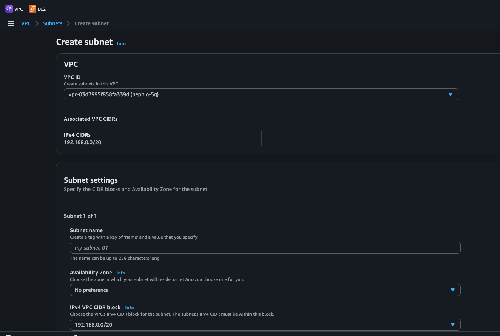
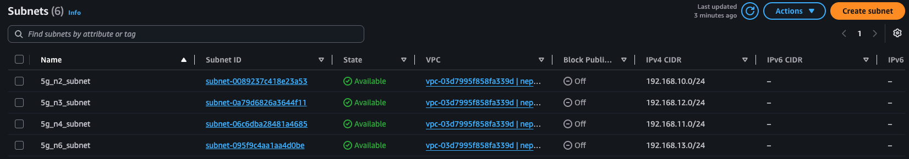
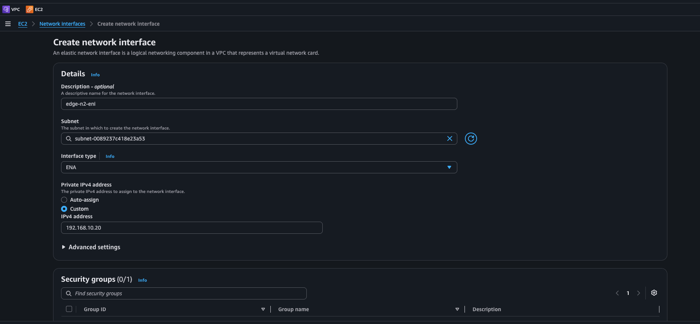
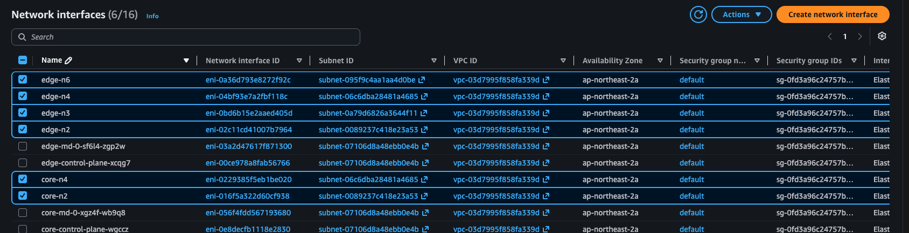
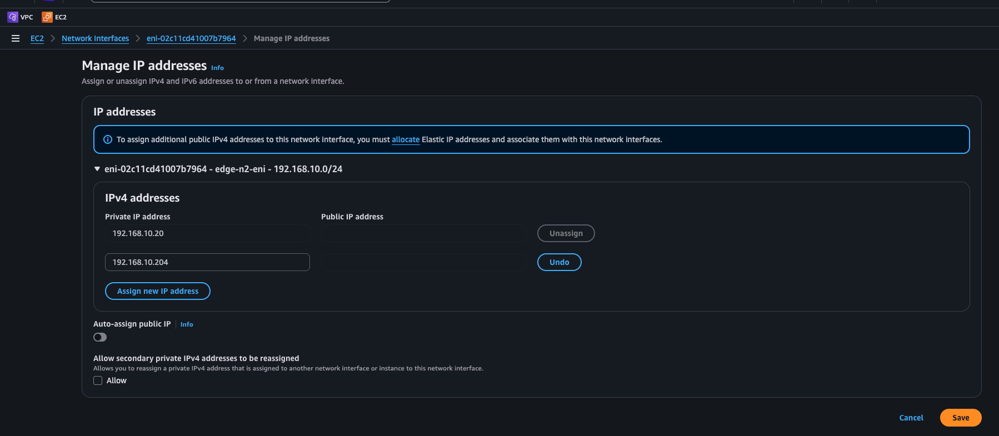
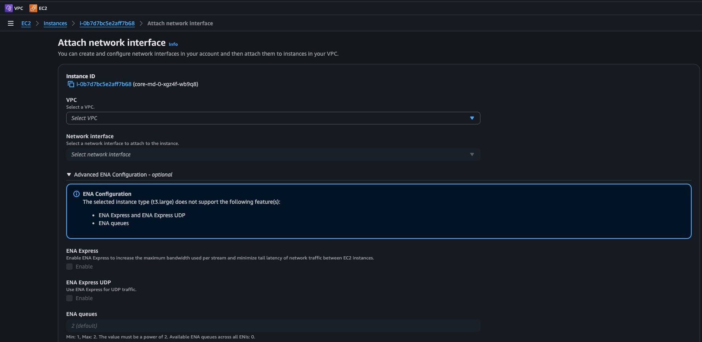
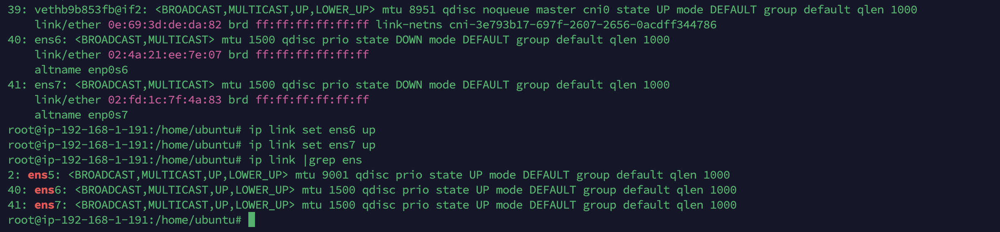
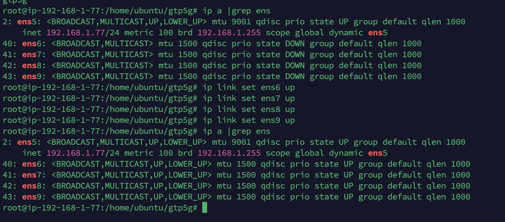

# 5G Stack Setup: Network Interfaces & Node Preparation (free5gc)

Pre-deployment preparation for the free5gc 5G stack — installing kernel modules, creating AWS network infrastructure, attaching interfaces to workload cluster nodes, and recording interface mappings for the 5G deployment configuration.

---

## Table of Contents

- [1. Install gtp5g Kernel Module (Edge Worker)](#1-install-gtp5g-kernel-module-edge-worker)
- [2. Network Topology Overview](#2-network-topology-overview)
- [3. Create Subnets on AWS Console](#3-create-subnets-on-aws-console)
- [4. Create Elastic Network Interfaces (ENIs)](#4-create-elastic-network-interfaces-enis)
- [5. Attach ENIs, Bring Up Interfaces & Record Mappings](#5-attach-enis-bring-up-interfaces--record-mappings)
- [6. Troubleshooting](#6-troubleshooting)

---

## 1. Install gtp5g Kernel Module (Edge Worker)

The `gtp5g` module is required by free5gc UPF for GTP tunnel encapsulation. It must be installed on the **edge worker node** only.

from management cluster, get IP of edge worker node and SSH into the edge worker node:

```bash
ssh -i <keypair.pem> ubuntu@<edge-worker-public-ip>
sudo su
```

**Step 1 — Install required build tools and kernel headers:**

```bash
sudo apt update
sudo apt install -y build-essential make git linux-headers-$(uname -r)
```

**Step 2 — Check which compiler was used to build the running kernel:**

```bash
cat /proc/version
```

For Ubuntu 22.04 with AWS kernel `6.8.x`, the kernel is commonly built with GCC 12. Install and use the real GCC 12 compiler:

```bash
sudo apt install -y gcc-12 g++-12
```

**If `gcc-12` installation fails due to a `gcc-12-base` version conflict**, first unhold and upgrade the related GCC runtime packages:

```bash
sudo apt-mark unhold \
  gcc-12-base libgcc-s1 libstdc++6 libcc1-0 libgomp1 libitm1 \
  libatomic1 libasan8 liblsan0 libtsan2 libubsan1 libquadmath0 \
  cpp-12 gcc-12 g++-12 || true

sudo apt install -y --only-upgrade \
  gcc-12-base \
  libgcc-s1 \
  libstdc++6 \
  libcc1-0 \
  libgomp1 \
  libitm1 \
  libatomic1 \
  libasan8 \
  liblsan0 \
  libtsan2 \
  libubsan1 \
  libquadmath0

sudo apt install -y gcc-12 g++-12
```

**Step 3 — Clone and build gtp5g:**

```bash
export CC=gcc-12

git clone https://github.com/free5gc/gtp5g.git
cd gtp5g
git checkout v0.8.6 #use this version for free5gc v3.4.3
make
sudo make install
```

Verify the module is loaded:

```bash
lsmod | grep gtp5g
```

Expected output:

```
gtp5g                  65536  0
```

Load the module automatically on reboot:

```bash
echo "gtp5g" | sudo tee -a /etc/modules
```

---

## 2. Network Topology Overview


The free5gc topology uses 4 dedicated subnets to isolate each 5G interface plane:

| Subnet | CIDR | Purpose |
|---|---|---|
| `5g_n2_subnet` | `192.168.10.0/24` | N2 — AMF ↔ gNB control plane |
| `5g_n4_subnet` | `192.168.11.0/24` | N4 — SMF ↔ UPF session management |
| `5g_n3_subnet` | `192.168.12.0/24` | N3 — gNB ↔ UPF user plane tunnel |
| `5g_n6_subnet` | `192.168.13.0/24` | N6 — UPF ↔ Data network (internet) |

**ENI assignment per cluster:**

| ENI Name | IP Address | Plane | Cluster | 5G Function |
|---|---|---|---|---|
| `core_n2_eni` | `192.168.10.10` | N2 | Core worker | AMF_N2_IP |
| `core_n4_eni` | `192.168.11.176` | N4 | Core worker | SMF_N4_IP |
| `edge_n2_eni` | `192.168.10.20` | N2 | Edge worker | gNB_N2_IP |
| `edge_n4_eni` | `192.168.11.20` | N4 | Edge worker | UPF_N4_IP |
| `edge_n3_eni` | `192.168.12.20` | N3 | Edge worker | UPF_N3_IP |
| `edge_n6_eni` | `192.168.13.20` | N6 | Edge worker | UPF_N6_IP |

---

## 3. Create Subnets on AWS Console

All subnets must be created in the **same VPC and Availability Zone** as the workload cluster nodes.

Navigate to **VPC → Subnets → Create subnet** and create the following 4 subnets:


| Name | IPv4 CIDR | AZ |
|---|---|---|
| `5g_n2_subnet` | `192.168.10.0/24` | same AZ as worker nodes |
| `5g_n4_subnet` | `192.168.11.0/24` | same AZ as worker nodes |
| `5g_n3_subnet` | `192.168.12.0/24` | same AZ as worker nodes |
| `5g_n6_subnet` | `192.168.13.0/24` | same AZ as worker nodes |

<!-- Screenshot: 4 subnets created and listed in VPC console -->

5G subnets created:




## 4. Create Elastic Network Interfaces (ENIs)

Navigate to **EC2 → Network Interfaces → Create network interface**.

Fill in the form as follows for each ENI:
- **Description**: ENI name (e.g. `edge-n2-eni`)
- **Subnet**: select the corresponding 5G subnet
- **Interface type**: `ENA`
- **Private IPv4 address**: select `Custom` and enter the fixed IP (Primary IP)
- **Security groups**: select the same security group used by the workload cluster nodes (typically `default`)



### 4.1 Core cluster ENIs

| ENI Name | Subnet | Primary IP | 5G Function |
|---|---|---|---|
| `core_n2_eni` | `5g_n2_subnet` | `192.168.10.10` | AMF_N2_IP |
| `core_n4_eni` | `5g_n4_subnet` | `192.168.11.176` | SMF_N4_IP |

### 4.2 Edge cluster ENIs

| ENI Name | Subnet | Primary IP | 5G Function |
|---|---|---|---|
| `edge_n2_eni` | `5g_n2_subnet` | `192.168.10.20` | gNB_N2_IP |
| `edge_n4_eni` | `5g_n4_subnet` | `192.168.11.20` | UPF_N4_IP |
| `edge_n3_eni` | `5g_n3_subnet` | `192.168.12.20` | UPF_N3_IP |
| `edge_n6_eni` | `5g_n6_subnet` | `192.168.13.20` | UPF_N6_IP |

All 6 ENIs created and listed in EC2 console
<!-- Screenshot: all 6 ENIs created and listed in EC2 console -->


> **Note:** Make sure the ENI status is `available` before proceeding to attach.

### 4.3 Add secondary private IPv4 address to each ENI

After creating each ENI, assign a secondary IP address. Navigate to **EC2 → Network Interfaces** → select the ENI → **Actions → Manage IP addresses** → **Assign new IP address**, then click **Save**.



| ENI | Primary IP | Secondary IP |
|---|---|---|
| `core_n2_eni` | `192.168.10.10` | `192.168.10.200` |
| `core_n4_eni` | `192.168.11.176` | `X` |
| `edge_n2_eni` | `192.168.10.20` | `192.168.10.204` |
| `edge_n4_eni` | `192.168.11.20` | `192.168.11.202` |
| `edge_n3_eni` | `192.168.12.20` | `192.168.12.201 & 192.168.12.205` |
| `edge_n6_eni` | `192.168.13.20` | `192.168.13.203` |

> Secondary IPs must be within the same subnet CIDR and not already in use — the exact values are flexible.


## 5. Attach ENIs, Bring Up Interfaces & Record Mappings

Navigate to **EC2 → Instances**, select instance (worker node of edge and core cluster) → **Actions → Networking -> Attach network interface**, choose the target VPC and Network Interface and then Attach.



> **Interface naming convention:** On AWS EC2 with Ubuntu 22.04, the primary interface is `ens5` (device index 0). Additional ENIs are named sequentially based on device index:
>
> | Device index | Interface name |
> |---|---|
> | 0 (primary) | `ens5` |
> | 1 | `ens6` |
> | 2 | `ens7` |
> | 3 | `ens8` |
> | 4 | `ens9` |
>
> **Attach ENIs in order** to guarantee the mapping is predictable.

### 5.1 Core worker node

**Attach via AWS Console:**

| ENI | Interface name | Expected interface |
|---|---|---|
| `core_n2_eni` | ens6 | `ens6` → `192.168.10.10` (AMF_N2_IP) |
| `core_n4_eni` | ens7 | `ens7` → `192.168.11.176` (SMF_N4_IP) |


**SSH in to core-worker node and bring up interfaces:**

```bash
ssh -i <keypair.pem> ubuntu@<core-worker-public-ip>
sudo su
```

```bash
# Bring up ens6 (core_n2_eni — AMF N2)
ip link set ens6 up

# Bring up ens7 (core_n4_eni — SMF N4)
ip link set ens7 up
```


**Expected output:**



### 5.2 Edge worker node

**Attach via AWS Console:**

| ENI | Interface Name | Expected interface |
|---|---|---|
| `edge_n2_eni` | ens6 | `ens6` → `192.168.10.20` (gNB_N2_IP) |
| `edge_n4_eni` | ens7 | `ens7` → `192.168.11.20` (UPF_N4_IP) |
| `edge_n3_eni` | ens8 | `ens8` → `192.168.12.20` (UPF_N3_IP) |
| `edge_n6_eni` | ens9 | `ens9` → `192.168.13.20` (UPF_N6_IP) |


**SSH in and bring up interfaces:**

```bash
ssh -i <keypair.pem> ubuntu@<edge-worker-public-ip>
sudo su
```

```bash
# Bring up ens6 (edge_n2_eni — gNB N2)
ip link set ens6 up

# Bring up ens7 (edge_n4_eni — UPF N4)
ip link set ens7 up

# Bring up ens8 (edge_n3_eni — UPF N3)
ip link set ens8 up

# Bring up ens9 (edge_n6_eni — UPF N6)
ip link set ens9 up
```

**Expected output:**


> **Save these mappings** — they are required when editing the free5gc network attachment definitions (`nad-*.yaml`) in the deployment step.

---

## 6. Troubleshooting

| Symptom | Cause | Fix |
|---|---|---|
| ENI stuck in `available` after attach | Wrong instance or AZ mismatch | Confirm the target instance is in the same AZ as the subnet |
| Interface not visible after attach | Kernel has not recognized the new device | Run `sudo udevadm trigger` or reboot the node |
| `dhclient` gets no IP | Security group blocking DHCP | Ensure security group allows all traffic within the VPC CIDR |
| `gtp5g: make` fails | Missing kernel headers | Run `sudo apt install linux-headers-$(uname -r)` |
| Interface names not as expected (ens6/7...) | ENIs attached out of order | Check `ip link show` and map by IP instead of name |
| IPs assigned but wrong interface names | Attachment order changed | Re-run `ip -o addr show` and update the mapping table |

---

*Back to: [01-clusters-setup.md](01-clusters-setup.md)*
