# FaaS-5G Stack Setup: free5gc + Knative Deployment


## System Architecture 
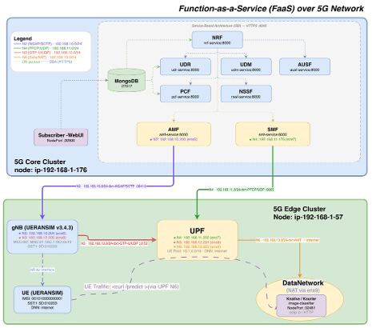

End-to-end deployment of the FaaS-5G stack using the Nephio-based approach. 

Two phases: 
- **Phase 1** deploys the free5gc 5G core network (Control Plane, UPF, UE, gNB simulator) across core and edge workload clusters. 
- **Phase 2** deploys the Knative serverless platform and image-classification FaaS application as Application Server in DataNetwork of 5G Network, then validates traffic flows end-to-end through the 5G data path and Function-as-a-Service features.

---

## Table of Contents

- [Phase 1: Deploy free5gc 5G Stack](#phase-1-deploy-free5gc-5g-stack)
  - [1. Register Workload Catalog Repository](#1-register-workload-catalog-repository)
  - [2. Deploy Control Plane NFs on Core Cluster](#2-deploy-control-plane-nfs-on-core-cluster)
  - [3. Create UE Subscriber in WebUI](#3-create-ue-subscriber-in-webui)
  - [4. Deploy UPF and UE Simulator on Edge Cluster](#4-deploy-upf-and-ue-simulator-on-edge-cluster)
  - [5. Verify UE PDU Session](#5-verify-ue-pdu-session)
- [Phase 2: Deploy FaaS Platform and Application](#phase-2-deploy-faas-platform-and-application)
  - [6. Deploy Knative Core](#6-deploy-knative-core)
  - [7. Deploy Image Classifier FaaS Application](#7-deploy-image-classifier-faas-application)
  - [8. Setup UE and UPF for Application Traffic](#8-setup-ue-and-upf-for-application-traffic)
  - [9. End-to-End FaaS Traffic Validation](#9-end-to-end-faas-traffic-validation)

---

## Phase 1: Deploy free5gc 5G Stack

### 1. Register Workload Catalog Repository

Register the external workload catalog repository with the Nephio management cluster so that Nephio can discover and deploy packages from it.

**Using the Nephio UI:**

Navigate to the Nephio UI, go to **Repositories → Register Repository**, and fill in:

| Field | Value |
|---|---|
| Repository URL | `https://github.com/bactp/workload-catalog.git` |
| Type | `Git` |
| Authentication Type | `None` |
| Name | `workload-catalog-faas` |


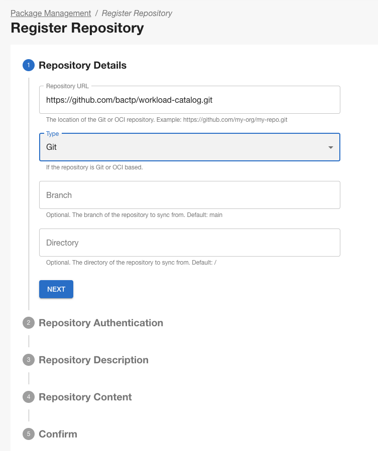

### 2. Deploy Control Plane NFs on Core Cluster

Two packages are deployed onto the **core workload cluster**:

| Package | Function |
|---|---|
| `free5gc-workload/pkg-free5gc-cp` | AMF, SMF, NRF, NSSF, PCF, UDM, UDR, AUSF |
| `free5gc-workload/pkg-free5gc-webui` | Subscriber management Web UI |

#### 2.1 Deploy pkg-free5gc-cp

In the Nephio UI, navigate to **core repository-> Add Deployment → Create a new deployment by cloning a external blueprint**:

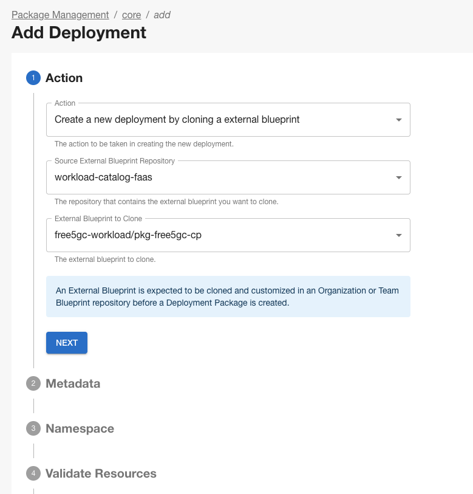


**Get the Private IP DNS name (IPv4 only)** of core-worker and edge-worker node.

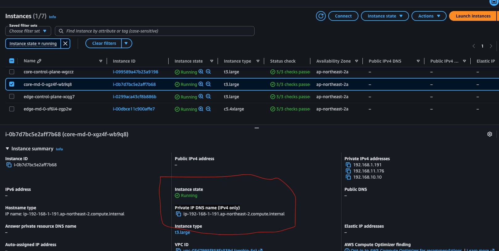

```yaml
core: ip-192-168-1-191.ap-northeast-2.compute.internal
edge: ip-192-168-1-77.ap-northeast-2.compute.internal
```

**Edit ConfigMap `setters.yaml`** in the package draft to set the worker node name for NF pod scheduling:


```yaml
# setters.yaml (pkg-free5gc-cp)
apiVersion: v1
kind: ConfigMap
metadata:
  name: setters
  namespace: free5gc
data:
  # Worker node names for scheduling NF pods
  core-worker-node: ip-192-168-1-191.ap-northeast-2.compute.internal
  edge-worker-node: ip-192-168-1-77.ap-northeast-2.compute.internal
```

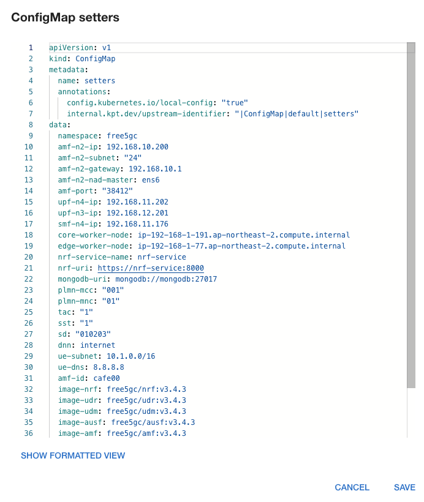

> Both `core-worker-node` and `edge-worker-node` are present in the setters because the Multus network attachment definitions reference the edge interface IPs as well. Set the values above exactly as shown.

**Save -> Propose-> Approve** and Wait for all Control Plane NFs to reach `Running`.

**Force sync with argocd to sync immediately**

```cmd
kubectl -n argocd annotate application core \
  argocd.argoproj.io/refresh=hard \
  --overwrite \
  --kubeconfig core.kubeconfig

kubectl -n argocd patch application core \
  --type merge \
  --kubeconfig core.kubeconfig \
  -p '{
    "operation": {
      "sync": {
        "syncOptions": [
          "Force=true",
          "Replace=true"
        ],
        "syncStrategy": {
          "hook": {}
        }
      }
    }
  }'
```


Expected pods (all `Running`):
```cmd
kubectl get pod -n free5gc --kubeconfig core.kubeconfig
```


```
NAME                    READY   STATUS    RESTARTS   AGE
amf-59866548ff-52xwd    1/1     Running   0          81s
ausf-5b4674d878-9b8ck   1/1     Running   0          81s
mongodb-0               1/1     Running   0          81s
nrf-688d8447dd-rqd2l    1/1     Running   0          81s
nssf-7f6ff6cf86-jv75d   1/1     Running   0          81s
pcf-586bf5d498-sbm78    1/1     Running   0          81s
smf-7b989f4f6b-9g5qw    1/1     Running   0          81s
udm-fc7c8cd99-b8phx     1/1     Running   0          81s
udr-6d7645d9d-stg7f     1/1     Running   0          81s
```

#### 2.2 Deploy pkg-free5gc-webui

Repeat the same process for the WebUI package:
- Package: `free5gc-workload/pkg-free5gc-webui`
- Target cluster: `core`


Approve and wait for the pod to be `Running`:

```bash
kubectl --kubeconfig core.kubeconfig get pods -n free5gc | grep webui
```

---

### 3. Create UE Subscriber in WebUI

The free5gc WebUI is used to provision subscriber data for the simulated UE.

**Access the WebUI:**

The WebUI is exposed via the core cluster. Portforward on the local machine (default NodePort:30500)

```bash
ssh -i mynephio2025.pem -L 30500:<core-worker-node-IP>:30500 ubuntu@<public-IP-mgmt-cluster>
http://127.0.0.1:30500
```

Open the WebUI in a browser (http://127.0.0.1:30500) and log in:
- **Username:** `admin`
- **Password:** `free5gc`

<!-- Screenshot: free5gc WebUI login page -->
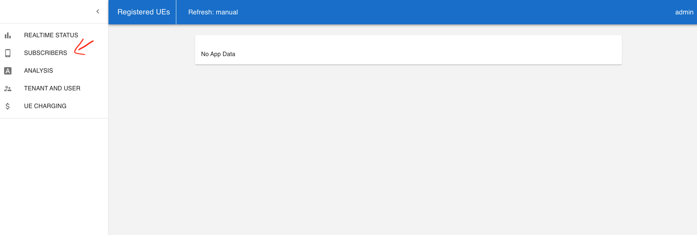

**Create a new subscriber** with the following values:

Navigate to **Subscribers → + Add Subscriber** and enter:

| Field | Value |
|---|---|
| SUPI / IMSI | `imsi-001010000000001` |
| PLMN ID | `00101` |
| MCC | `001` |
| MNC | `01` |
| Authentication Method | `5G_AKA` |
| Permanent Key (K) | `8baf473f2f8fd09487cccbd7097c6862` |
| Operator Code Type | `OPC` |
| Operator Code Value (OPc) | `8e27b6af0e692e750f32667a3b14605d` |
| AMF | `8000` |
| SQN | `000000000000` |


Click **Submit** to provision the subscriber.

<!-- Screenshot: free5gc WebUI subscriber creation form -->
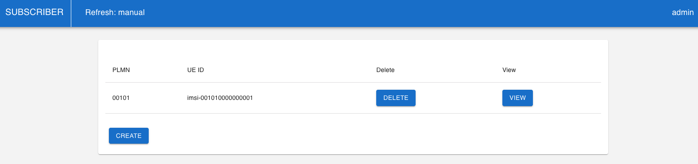

---

### 4. Deploy UPF and UE Simulator on Edge Cluster

Two packages are deployed onto the **edge workload cluster**:

| Package | Function |
|---|---|
| `free5gc-workload/pkg-free5gc-upf` | User Plane Function (GTP tunnel termination) |
| `free5gc-workload/pkg-ueransim` | UERANSIM — simulated gNB + UE |

#### 4.1 Deploy pkg-free5gc-upf

- Source repository: `workload-catalog`
- Package: `free5gc-workload/pkg-free5gc-upf`
- Target cluster: `edge`

Edit `setters.yaml` to set the edge worker node:

```yaml
# setters.yaml (pkg-free5gc-upf)
apiVersion: v1
kind: ConfigMap
metadata:
  name: setters
  namespace: free5gc
data:
  edge-worker-node: ip-192-168-1-57.ap-northeast-2.compute.internal
```


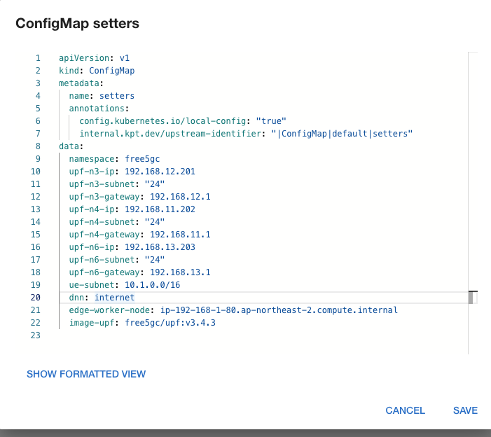


**Save -> Propose-> Approve** and Wait for all Control Plane NFs to reach `Running`.

**Force sync with argocd to sync immediately**

```cmd
kubectl -n argocd annotate application edge \
  argocd.argoproj.io/refresh=hard \
  --overwrite \
  --kubeconfig edge.kubeconfig

kubectl -n argocd patch application edge \
  --type merge \
  --kubeconfig edge.kubeconfig \
  -p '{
    "operation": {
      "sync": {
        "syncOptions": [
          "Force=true",
          "Replace=true"
        ],
        "syncStrategy": {
          "hook": {}
        }
      }
    }
  }'
```


Expected pods (all `Running`):
```cmd
kubectl get pod -n free5gc --kubeconfig edge.kubeconfig
```


```
NAME                  READY   STATUS    RESTARTS   AGE
upf-54fcbfbbb-5dwl6   1/1     Running   0          11s
```

#### 4.2 Deploy pkg-ueransim

- Package: `free5gc-workload/pkg-ueransim`
- Target cluster: `edge`

Edit `setters.yaml` with the edge worker node name (same as UPF above):

```yaml
# setters.yaml (pkg-ueransim)
apiVersion: v1
kind: ConfigMap
metadata:
  name: setters
  namespace: free5gc
data:
  edge-worker-node: ip-192-168-1-57.ap-northeast-2.compute.internal
```


**Save -> Propose-> Approve** and Wait for all Control Plane NFs to reach `Running`.

**Force sync with argocd to sync immediately**

```cmd
kubectl -n argocd annotate application edge \
  argocd.argoproj.io/refresh=hard \
  --overwrite \
  --kubeconfig edge.kubeconfig

kubectl -n argocd patch application edge \
  --type merge \
  --kubeconfig edge.kubeconfig \
  -p '{
    "operation": {
      "sync": {
        "syncOptions": [
          "Force=true",
          "Replace=true"
        ],
        "syncStrategy": {
          "hook": {}
        }
      }
    }
  }'
```


Expected pods (all `Running`):
```cmd
kubectl get pod -n free5gc --kubeconfig edge.kubeconfig
```


```
NAME                  READY   STATUS    RESTARTS   AGE
gnb-6d984d7c5-jjl7w   1/1     Running   0          16s
ue-64b6fdbc98-mhhvf   1/1     Running   0          16s
upf-54fcbfbbb-5dwl6   1/1     Running   0          2m54s
```
---

### 5. Verify UE PDU Session

Check the UE logs to confirm it has successfully established a PDU session with the core network:

```bash
kubectl --kubeconfig edge.kubeconfig logs -n free5gc deploy/ue
```

Look for log lines indicating PDU session establishment, for example:

```
[2026-07-02 05:58:20.224] [nas] [info] PDU Session establishment is successful PSI[1]
[2026-07-02 05:58:20.238] [app] [info] Connection setup for PDU session[1] is successful, TUN interface[uesimtun0, 10.1.0.1] is up
```

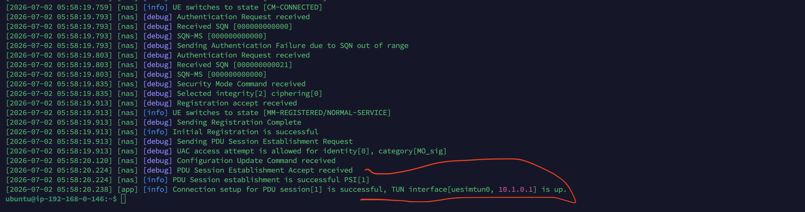


Exec into the UE pod and verify the tunnel interface exists:

```bash
kubectl --kubeconfig edge.kubeconfig exec -n free5gc deploy/ue -- ip addr show uesimtun0
```

```bash
ubuntu@ip-192-168-0-146:~$ kubectl --kubeconfig edge.kubeconfig exec -n free5gc deploy/ue -- ip addr show uesimtun0
Defaulted container "ue" out of: ue, wait-for-gnb (init)
3: uesimtun0: <POINTOPOINT,PROMISC,NOTRAILERS,UP,LOWER_UP> mtu 1400 qdisc fq_codel state UNKNOWN group default qlen 500
    link/none 
    inet 10.1.0.1/32 scope global uesimtun0
       valid_lft forever preferred_lft forever
    inet6 fe80::6706:6551:eee7:fd14/64 scope link stable-privacy 
       valid_lft forever preferred_lft forever
```

> **Phase 1 complete.** The free5gc 5G core is running, subscriber is provisioned, UE has a PDU session, and traffic can flow from UE → gNB → UPF → data network.


## Phase 2: Deploy FaaS Platform and Application

### 6. Deploy Knative Core

Deploy the Knative serverless platform onto the **edge cluster** from the catalog:

- Source repository: `workload-catalog`
- Package: `faas-knative/knative-core`
- Target cluster: `edge`

**Edit `setters.yaml`** to set the edge worker node IP (same value used in the 5G NF packages):

```yaml
# setters.yaml (faas-knative/knative-core)
apiVersion: v1
kind: ConfigMap
metadata:
  name: setters
  namespace: knative-serving
data:
  edge-worker-node: ip-192-168-1-57.ap-northeast-2.compute.internal
```

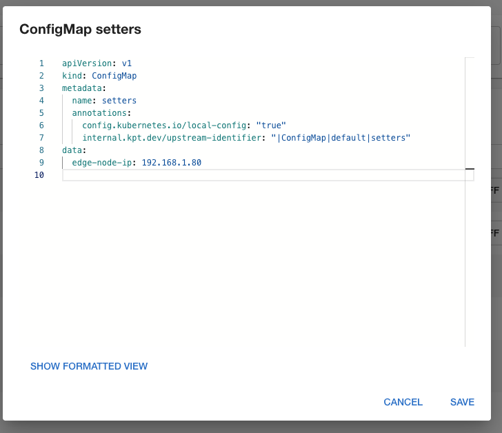


**Edit `config-domain.yaml`** to set the edge worker node IP (same value used in the 5G NF packages):

```yaml
data:
  192.168.1.57.sslip.io: ""
```

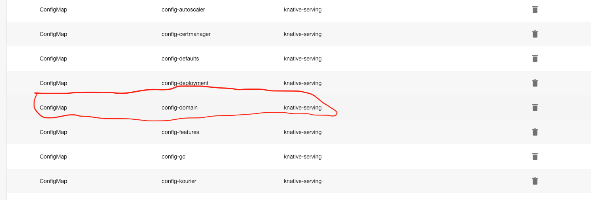

**Save → Propose → Approve**, then wait for all Knative pods to reach `Running`:

**Force sync with argocd to sync immediately**

```cmd
kubectl -n argocd annotate application edge \
  argocd.argoproj.io/refresh=hard \
  --overwrite \
  --kubeconfig edge.kubeconfig

kubectl -n argocd patch application edge \
  --type merge \
  --kubeconfig edge.kubeconfig \
  -p '{
    "operation": {
      "sync": {
        "syncOptions": [
          "Force=true",
          "Replace=true"
        ],
        "syncStrategy": {
          "hook": {}
        }
      }
    }
  }'
```


Expected pods (all `Running`):

```cmd
kubectl get pod -n knative-serving --kubeconfig edge.kubeconfig

NAME                                      READY   STATUS    RESTARTS   AGE
activator-d6d667ddc-b6zpz                 1/1     Running   0          70s
autoscaler-568f585c75-67dv4               1/1     Running   0          70s
controller-549d89fcf8-hsjmr               1/1     Running   0          70s
net-kourier-controller-7dd56d5d95-mhmzq   1/1     Running   0          70s
webhook-696956467d-bck2f                  1/1     Running   0          70s
```

```cmd
kubectl get pod -n kourier-system --kubeconfig edge.kubeconfig

NAME                                      READY   STATUS    RESTARTS      AGE
3scale-kourier-gateway-5669c7cbcd-f8626   1/1     Running   1 (77s ago)   2m17s
```
All pods must be `Running` before proceeding.

---

### 7. Deploy Image Classifier FaaS Application

Deploy the serverless image classification application onto the edge cluster:

- Source repository: `workload-catalog`
- Package: `image-classifier`
- Target cluster: `edge`

Approve and publish the package.

Wait for the Pod to become `Running`:

**Force sync with argocd to sync immediately**

```cmd
kubectl -n argocd annotate application edge \
  argocd.argoproj.io/refresh=hard \
  --overwrite \
  --kubeconfig edge.kubeconfig

kubectl -n argocd patch application edge \
  --type merge \
  --kubeconfig edge.kubeconfig \
  -p '{
    "operation": {
      "sync": {
        "syncOptions": [
          "Force=true",
          "Replace=true"
        ],
        "syncStrategy": {
          "hook": {}
        }
      }
    }
  }'
```


Expected pods (all `Running`):

```cmd
kubectl get pod --kubeconfig edge.kubeconfig

NAME                                                 READY   STATUS    RESTARTS   AGE
image-classifier-00001-deployment-68bbd5f66c-2p462   2/2     Running   0          60s


kubectl --kubeconfig edge.kubeconfig get ksvc -n default -w

NAME               URL                                                     LATESTCREATED            LATESTREADY              READY   REASON
image-classifier   http://image-classifier.default.192.168.1.80.sslip.io   image-classifier-00001   image-classifier-00001   True    
```

After the initial pod comes up and goes idle, Knative will scale it down to zero — this is expected (`Terminating` then no pod). The application is ready when `READY=True` on the ksvc.

```bash
kubectl --kubeconfig edge.kubeconfig get pods

NAME                                                 READY   STATUS        RESTARTS   AGE
image-classifier-00001-deployment-68bbd5f66c-2p462   1/2     Terminating   0          2m20s
# Pods may show Terminating or no pods after scale-to-zero — that is correct. "No resources found in default namespace."
```

---

### 8. Setup UE and UPF for Application Traffic

Before sending test traffic, install required tools in both the UE and UPF pods, and configure routing so that traffic from the UE (via `uesimtun0`) can reach the application server on the edge worker.

**Exec into the UE and UPF pods and install tools:**

```bash
# UE pod
kubectl --kubeconfig edge.kubeconfig -n free5gc exec -it deploy/ue -- bash

# UPF pod
kubectl --kubeconfig edge.kubeconfig -n free5gc exec -it deploy/upf -- bash
```

Inside each pod:

```bash
apt update
apt install -y curl tcpdump git ncurses-bin vim
```

**Configure UPF data network routing:**

Inside the **UPF** pod, add NAT masquerade rules so the 5G UE traffic (from `10.1.0.0/16`) can reach the application server network:

```bash
# Inside UPF pod
iptables -t nat -A POSTROUTING -s 10.1.0.0/16 -d 192.168.1.0/24 -o eth0 -j MASQUERADE
```

**Configure UE routing to send traffic via the 5G tunnel:**

Inside the **UE** pod, add a host route for the edge worker IP so that requests to the image classifier are sent over `uesimtun0` (the PDU session tunnel):

```bash
# Inside UE pod
ip route add 192.168.1.57 dev uesimtun0

# Verify the route resolves via the tunnel
ip route get 192.168.1.57
# Expected: 192.168.1.57 dev uesimtun0 ...
```

**Clone the test image dataset onto the UE pod:**

```bash
# Inside UE pod
git clone https://github.com/bactp/faas-app.git
```

---

### 9. End-to-End FaaS Traffic Validation

#### 9.1 Scale-from-zero — single request

Get the Kourier NodePort:

```bash
kubectl --kubeconfig edge.kubeconfig get svc -n kourier-system
```

Note the HTTP NodePort (e.g., `30:30327`) and substitute it in the curl command below.

From **inside the UE pod**, send a single inference request. Traffic flows: `uesimtun0 → UPF → edge worker → Kourier → image-classifier pod`:

```bash
# Inside UE pod
curl --interface uesimtun0 \
  -H "Host: image-classifier.default.<edge-worker-ip>.sslip.io" \
  -F "file=@/ueransim/faas-app/test_0_cat.png" \
  http://<edge-worker-ip>:<kourier-node-port>/predict

#example
curl --interface uesimtun0 \
  -H "Host: image-classifier.default.192.168.1.57.sslip.io" \
  -F "file=@/ueransim/faas-app/test_0_cat.png" \
  http://192.168.1.57:30327/predict
```

The first request triggers a cold start — Knative scales from zero and creates a new pod. Expected response:

```json
{"prediction":"cat","confidence":0.48018014430999756,"top_k":[{"rank":1,"class":"cat","confidence":0.48018014430999756},{"rank":2,"class":"frog","confidence":0.43542370200157166},{"rank":3,"class":"dog","confidence":0.06913672387599945}],"latency_ms":57.79,"filename":"test_0_cat.png"}
```

<!-- Screenshot: first curl request response and new pod appearing -->
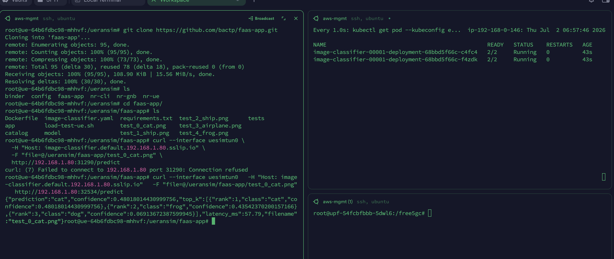

**Monitor UPF traffic** in a separate terminal to confirm packets are transiting through the 5G data plane:

```bash
# Inside UPF pod (separate exec session)
tcpdump -ni any "host <UE-IP> or host <EDGE-WORKER-IP> and tcp port <KOURIER-NODEPORT>"

#example
tcpdump -ni any "host 10.1.0.1 or host 192.168.1.80 and tcp port 32534"
```


```bash
root@upf-54fcbfbbb-5dwl6:/free5gc# tcpdump -ni any "host 10.1.0.1 or host 192.168.1.80 and tcp port 32534"
tcpdump: data link type LINUX_SLL2
tcpdump: verbose output suppressed, use -v[v]... for full protocol decode
listening on any, link-type LINUX_SLL2 (Linux cooked v2), snapshot length 262144 bytes
07:06:40.003568 upfgtp In  IP 10.1.0.1.40932 > 192.168.1.80.32534: Flags [S], seq 2097817488, win 65280, options [mss 1360,sackOK,TS val 3446246926 ecr 0,nop,wscale 7], length 0
07:06:40.003594 eth0  Out IP 10.244.1.39.40932 > 192.168.1.80.32534: Flags [S], seq 2097817488, win 65280, options [mss 1360,sackOK,TS val 3446246926 ecr 0,nop,wscale 7], length 0
07:06:40.003634 eth0  In  IP 192.168.1.80.32534 > 10.244.1.39.40932: Flags [S.], seq 2304284321, ack 2097817489, win 62293, options [mss 8911,sackOK,TS val 3917802474 ecr 3446246926,nop,wscale 7], length 0
07:06:40.003637 upfgtp Out IP 192.168.1.80.32534 > 10.1.0.1.40932: Flags [S.], seq 2304284321, ack 2097817489, win 62293, options [mss 8911,sackOK,TS val 3917802474 ecr 3446246926,nop,wscale 7], length 0
07:06:40.003995 upfgtp In  IP 10.1.0.1.40932 > 192.168.1.80.32534: Flags [.], ack 1, win 510, options [nop,nop,TS val 3446246927 ecr 3917802474], length 0
07:06:40.004003 eth0  Out IP 10.244.1.39.40932 > 192.168.1.80.32534: Flags [.], ack 1, win 510, options [nop,nop,TS val 3446246927 ecr 3917802474], length 0
07:06:40.004027 upfgtp In  IP 10.1.0.1.40932 > 192.168.1.80.32534: Flags [P.], seq 1:227, ack 1, win 510, options [nop,nop,TS val 3446246927 ecr 3917802474], length 226
```


After the request completes and the idle timeout passes, Knative terminates the pod (scale to zero). Observe the pod going `Terminating`:

```bash
kubectl --kubeconfig edge.kubeconfig get pods -n default -w

NAME                                                 READY   STATUS        RESTARTS   AGE
image-classifier-00001-deployment-68bbd5f66c-cfvkr   1/2     Terminating   0          2m26s
```

#### 9.2 Load test —  scale-out
Edit values in the traffic generation scripts with corresponding value of **EDGE-WORKER-IP** AND **KOURIER-NODEPORT**

Send 7 concurrent requests to trigger horizontal pod autoscaling:

```bash
# Inside UE pod
bash loadt-test-ue.sh <image-file> <number-of-concurrent requests>

#example
bash load-test-ue.sh test_0_cat.png 7
```

Watch new pods being created in real time on the edge cluster:

```bash
kubectl --kubeconfig edge.kubeconfig get pods

NAME                                                 READY   STATUS    RESTARTS   AGE
image-classifier-00001-deployment-68bbd5f66c-8n7zz   2/2     Running   0          14s
image-classifier-00001-deployment-68bbd5f66c-cpqc4   2/2     Running   0          12s
image-classifier-00001-deployment-68bbd5f66c-h6m5n   2/2     Running   0          10s
image-classifier-00001-deployment-68bbd5f66c-l2cg7   2/2     Running   0          16s
image-classifier-00001-deployment-68bbd5f66c-n9c7v   2/2     Running   0          14s
image-classifier-00001-deployment-68bbd5f66c-nc426   2/2     Running   0          12s
image-classifier-00001-deployment-68bbd5f66c-ngzrb   2/2     Running   0          12s
image-classifier-00001-deployment-68bbd5f66c-qbgrt   2/2     Running   0          14s
image-classifier-00001-deployment-68bbd5f66c-w59qd   2/2     Running   0          16s
```

Knative creates multiple `image-classifier-*` pods to serve the concurrent requests, demonstrating the FaaS autoscaling behavior over the 5G data path.


Expected Response:

```cmd
root@ue-64b6fdbc98-mhhvf:/ueransim/faas-app# bash load-test-ue.sh test_0_cat.png 7
────────────────────────────
Mode       : UE
URL        : http://192.168.1.80:32534/predict
Host       : image-classifier.default.192.168.1.80.sslip.io
Image      : test_0_cat.png
Concurrency: 7
Interface  : uesimtun0
Path       : 5G user plane
────────────────────────────
[req 3] latency=4420.978ms HTTP_CODE=200 LOCAL_IP=10.1.0.1 REMOTE_IP=192.168.1.80 TOTAL_TIME=4.412667 body={"prediction":"cat","confidence":0.48018014430999756,"top_k":[{"rank":1,"class":"cat","confidence":0.48018014430999756},{"rank":2,"class":"frog","confidence":0.43542370200157166},{"rank":3,"class":"dog","confidence":0.06913672387599945}],"latency_ms":60.29,"filename":"test_0_cat.png"}
[req 4] latency=4476.534ms HTTP_CODE=200 LOCAL_IP=10.1.0.1 REMOTE_IP=192.168.1.80 TOTAL_TIME=4.468125 body={"prediction":"cat","confidence":0.48018014430999756,"top_k":[{"rank":1,"class":"cat","confidence":0.48018014430999756},{"rank":2,"class":"frog","confidence":0.43542370200157166},{"rank":3,"class":"dog","confidence":0.06913672387599945}],"latency_ms":53.32,"filename":"test_0_cat.png"}
[req 1] latency=4532.558ms HTTP_CODE=200 LOCAL_IP=10.1.0.1 REMOTE_IP=192.168.1.80 TOTAL_TIME=4.523948 body={"prediction":"cat","confidence":0.48018014430999756,"top_k":[{"rank":1,"class":"cat","confidence":0.48018014430999756},{"rank":2,"class":"frog","confidence":0.43542370200157166},{"rank":3,"class":"dog","confidence":0.06913672387599945}],"latency_ms":53.78,"filename":"test_0_cat.png"}
[req 2] latency=4587.128ms HTTP_CODE=200 LOCAL_IP=10.1.0.1 REMOTE_IP=192.168.1.80 TOTAL_TIME=4.578549 body={"prediction":"cat","confidence":0.48018014430999756,"top_k":[{"rank":1,"class":"cat","confidence":0.48018014430999756},{"rank":2,"class":"frog","confidence":0.43542370200157166},{"rank":3,"class":"dog","confidence":0.06913672387599945}],"latency_ms":52.75,"filename":"test_0_cat.png"}
[req 5] latency=4644.140ms HTTP_CODE=200 LOCAL_IP=10.1.0.1 REMOTE_IP=192.168.1.80 TOTAL_TIME=4.635373 body={"prediction":"cat","confidence":0.48018014430999756,"top_k":[{"rank":1,"class":"cat","confidence":0.48018014430999756},{"rank":2,"class":"frog","confidence":0.43542370200157166},{"rank":3,"class":"dog","confidence":0.06913672387599945}],"latency_ms":54.76,"filename":"test_0_cat.png"}
[req 7] latency=4698.631ms HTTP_CODE=200 LOCAL_IP=10.1.0.1 REMOTE_IP=192.168.1.80 TOTAL_TIME=4.690248 body={"prediction":"cat","confidence":0.48018014430999756,"top_k":[{"rank":1,"class":"cat","confidence":0.48018014430999756},{"rank":2,"class":"frog","confidence":0.43542370200157166},{"rank":3,"class":"dog","confidence":0.06913672387599945}],"latency_ms":52.9,"filename":"test_0_cat.png"}
[req 6] latency=4701.965ms HTTP_CODE=200 LOCAL_IP=10.1.0.1 REMOTE_IP=192.168.1.80 TOTAL_TIME=4.694194 body={"prediction":"cat","confidence":0.48018014430999756,"top_k":[{"rank":1,"class":"cat","confidence":0.48018014430999756},{"rank":2,"class":"frog","confidence":0.43542370200157166},{"rank":3,"class":"dog","confidence":0.06913672387599945}],"latency_ms":59.49,"filename":"test_0_cat.png"}
────────────────────────────
wall-clock: 4710.105 ms  (7 requests)
```

<!-- Screenshot: multiple image-classifier pods running during load test -->
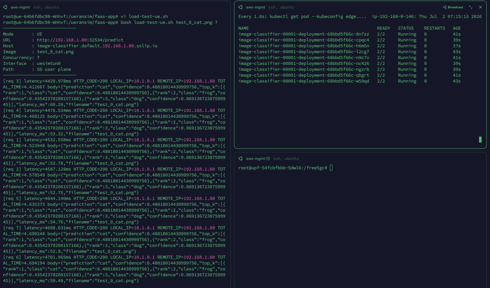


> **Phase 2 complete.** The Knative serverless platform is running on the edge cluster. The image-classifier FaaS application scales from zero on demand, and all traffic is routed through the free5gc UPF via the `uesimtun0` 5G PDU session.

---

## Summary

| Step | Component | Cluster |
|---|---|---|
| Register workload-catalog | Nephio catalog repo | Management |
| Deploy pkg-free5gc-cp | AMF, SMF, NRF, PCF, UDM... | Core |
| Deploy pkg-free5gc-webui | Subscriber management | Core |
| Create UE subscriber | WebUI configuration | Core |
| Deploy pkg-free5gc-upf | UPF (data plane) | Edge |
| Deploy pkg-ueransim | gNB + UE simulator | Edge |
| Deploy knative-core | Serverless platform (Kourier auto-configured) | Edge |
| Deploy faas-image-classifier | FaaS application | Edge |
| End-to-end traffic test | 5G → FaaS → autoscale | Edge |

---

*Back to: [02-5g-stack-setup.md](02-5g-stack-setup.md)*
